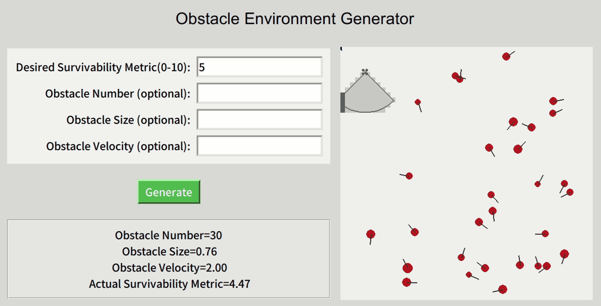

# Gym for 2D active perception
This is a repository for OpenAI gym environment. The general task is navigation of MAV with limited field of view in unknown and dynamic environment. The accompanying paper can be reviewed [here](https://smoggy-p.github.io/Evaluating_Dynamic_Difficulty/).


## Basic Usage
### Run Experiment
To run an experiment, an example command is listed below:
```bash
python main.py --gaze_method Oxford --planner Primitive --agent_number 10 --agent_max_speed 20 --agent_radius 15 --drone_max_speed 40 --map_id 1
```
There are many parameters that can be pre-defined. By running `python main.py -h`, a list of all parameters can be seen.

### Map Generator
To generate a new map with pre-defined difficulty level, an example command is listed below:
```bash
python ./script/fit.py
```
An GUI will be shown where you can define the survivability difficulty level and generate a map accordingly. The number, radius, and speed of the dynamic obstacles can also be optionally pre-defined.


### Metric Calculation in Gazebo
Another repository is used to calculate the metric in Gazebo. The repository can be found [here](https://github.com/smoggy-P/metric_test_gazebo).