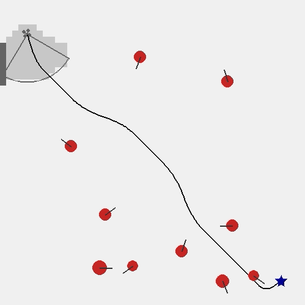

# Drone2D — 2-D Active Perception Gym Environment

A modular OpenAI Gym environment for studying **navigation and active perception** of micro aerial vehicles (MAVs) with a limited field-of-view sensor in unknown, dynamic environments.

The accompanying paper can be reviewed [here](https://smoggy-p.github.io/Evaluating_Dynamic_Difficulty/).



---

## Project Structure

```
drone2d/                  # Main Python package
├── config.py             # SimConfig dataclass & constants
├── agent.py              # Dynamic obstacle Agent & RVO collision avoidance
├── drone.py              # Drone2D model (motion, perception, tracking)
├── kalman_filter.py      # Linear Kalman filter for obstacle tracking
├── grid_map.py           # OccupancyGridMap
├── raycast.py            # 2-D fan-shaped ray-casting sensor
├── trajectory.py         # Trajectory2D & Waypoint2D containers
├── rendering.py          # Pygame drawing helpers
├── planners/             # Trajectory planners
│   ├── base.py           #   Abstract Planner base class
│   ├── primitive.py      #   Motion-primitive A* search
│   ├── jerk_primitive.py #   Jerk-optimal polynomial primitives
│   ├── mpc.py            #   MPC planner (requires FORCESPRO)
│   └── no_move.py        #   Stationary baseline
├── gaze/                 # Gaze (yaw) control policies
│   ├── look_ahead.py     #   Look in velocity direction
│   ├── oxford.py         #   Information-gain maximisation
│   ├── rotating.py       #   Constant rotation
│   ├── owl.py            #   Multi-objective cost planner
│   ├── look_goal.py      #   Look towards unexplored cells
│   └── no_control.py     #   360° vision (no control needed)
└── envs/                 # Gym environments
    ├── drone_env.py      #   Full perception–planning–control loop
    └── metric_env.py     #   Simplified env for metric computation

experiment.py             # Experiment runner (episode loop + CSV logging)
main.py                   # CLI entry point
model/extractor.py        # SB3 CNN feature extractors for RL training
demos/                    # Standalone demo / visualisation scripts
scripts/                  # Training & analysis scripts
```

## Installation

```bash
# Clone the repository
git clone https://github.com/smoggy-P/gym-Drone2D-ActivePerception.git
cd gym-Drone2D-ActivePerception

# Install in development mode
pip install -e .

# Or install with RL training dependencies
pip install -e ".[train]"
```

## Quick Start

### Run an Experiment

```bash
python main.py --gaze_method Oxford --planner Primitive \
               --agent_number 10 --agent_max_speed 20 \
               --agent_radius 15 --drone_max_speed 40 --map_id 1
```

Run `python main.py -h` for a full list of configurable parameters.

### Programmatic Usage

```python
import gym
from drone2d.config import SimConfig
import drone2d.envs  # registers Gym environments

config = SimConfig(
    agent_number=10,
    drone_max_speed=40,
    gaze_method="LookAhead",
    planner="Primitive",
    render=True,
)

env = gym.make("drone-2d-perception-v2", config=config)
obs = env.reset()

done = False
while not done:
    action = 0  # normalised yaw command in [-1, 1]
    obs, reward, done, info = env.step(action)
    env.render()
```

### Train an RL Gaze Policy

```bash
python scripts/train.py
```

### Map Generator

```bash
python scripts/fit.py
```

## Available Planners

| Name              | Description                                |
|-------------------|--------------------------------------------|
| `Primitive`       | Motion-primitive A* search (default)       |
| `Jerk_Primitive`  | Jerk-optimal polynomial primitives         |
| `MPC`             | Model Predictive Control (needs FORCESPRO) |
| `NoMove`          | Stationary (for metric evaluation)         |

## Available Gaze Methods

| Name         | Description                                      |
|--------------|--------------------------------------------------|
| `LookAhead`  | Camera follows velocity direction                |
| `Oxford`     | Information-gain maximisation over reward map     |
| `Rotating`   | Constant-speed rotation                          |
| `Owl`        | Multi-objective cost balancing                   |
| `LookGoal`   | Look at first unexplored cell on trajectory      |
| `NoControl`  | 360° FOV — no gaze control needed                |

## Metric Calculation in Gazebo

A separate repository is used for Gazebo-based metric evaluation:
[metric_test_gazebo](https://github.com/smoggy-P/metric_test_gazebo).

## License

See [LICENSE](LICENSE) for details.
