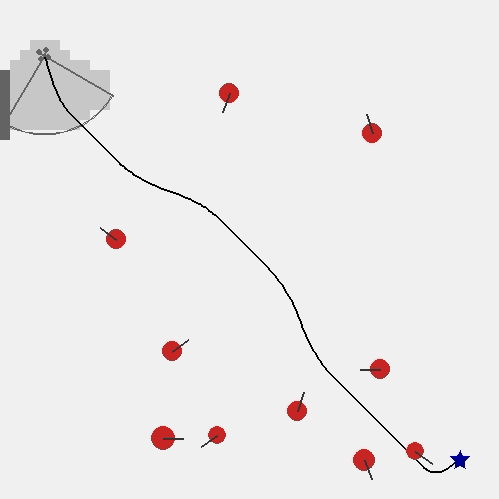

# Gym for 2D active perception
This is a repository for OpenAI gym environment. The general task is navigation of MAV with limited field of view in unknown and dynamic environment.


## Basic Usage
### Run Experiment
To run an experiment, an example command is listed below:
```bash
python main.py --gaze-method Oxford --agent-number 10 --map-size 640 640 --map-scale 10 --dt 0.1 --agent-max-speed 20 --agent-radius 15 --drone-max-speed 40 --drone-max-acceleration 15 --drone-radius 10 --drone-max-yaw-speed 180
```
There are many parameters that can be pre-defined. By running `python main.py -h`, a list of all parameters can be seen:
```bash
optional arguments:
  -h, --help            show this help message and exit
  --gaze-method GAZE_METHOD
                        Method used (default: Oxford)
  --render              render (default: False)
  --dt DT               environment update time (default: 0.1)
  --map-size MAP_SIZE [MAP_SIZE ...]
                        map size (default: 640*480)
  --map-scale MAP_SCALE
                        map compression scale when building gridmap (default:
                        10 i.e. 64*48 gridmap)
  --agent-number AGENT_NUMBER
                        agent number (default: 5)
  --agent-max-speed AGENT_MAX_SPEED
                        agent max speed (default: 20)
  --agent-radius AGENT_RADIUS
                        agent radius (default: 10)
  --drone-max-speed DRONE_MAX_SPEED
                        drone max speed (default: 40)
  --drone-max-acceleration DRONE_MAX_ACCELERATION
                        drone max acc (default: 15)
  --drone-radius DRONE_RADIUS
                        drone radius (default: 10)
  --drone-max-yaw-speed DRONE_MAX_YAW_SPEED
                        drone max yaw speed (default: 80 degrees / s)

```